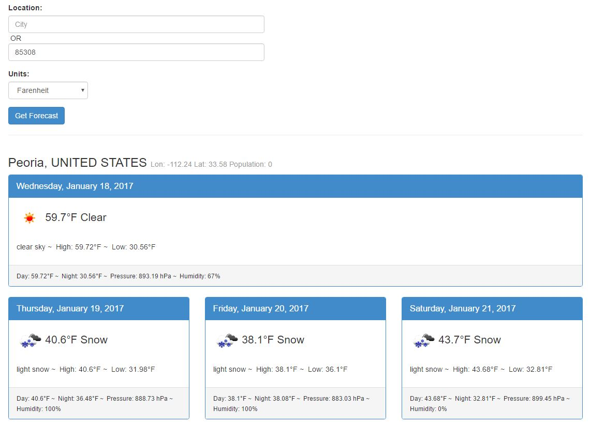

# Weather App

When entered a city and a choice of the temperature unit, the app should show current weather and forecast for next few days.

# Attribution

Inspiration for the app came from: https://github.com/atufkas/angular-openweather-app

## Installation

- To download the project `git clone https://github.com/ramarajuv/weather-app.git`
- Download dependencies using npm `npm install`
- Download dependencies using npm `bower install`
- Open app on browser `http://localhost:8000`

## Karma Tests

- Please ensure you have `karma-cli`
- From project root folder run `npm run test`

## Swagger API/Tests

- Please ensure `swagger-cli` is already installed. Can be installed using npm `npm install -g swagger`
- From the project root folder run `swagger project start` and `swagger project edit`

## Mocha API/Tests

- From the project root folder run `node_modules/.bin/mocha test/mocha` i.e execute mocha script on the location of the mocha test files.

## Screenshot

